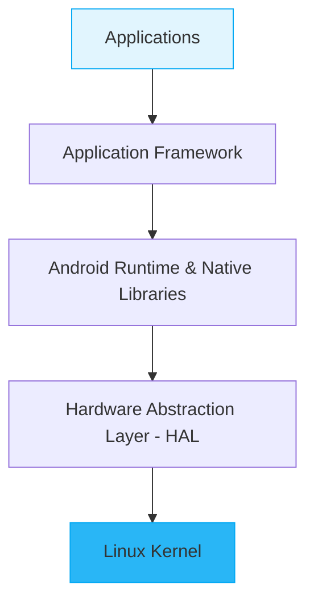

# Mobile Application Development (MAD) - Part 3
**Questions 36 to 50: Analytical & Comparative Questions (Updated)**

এই পার্টটাও আপনার পিডিএফের হুবহু পয়েন্টগুলো দিয়ে সাজিয়েছি। সাথে পার্থক্যগুলোর জন্য **ছক (Table)**, আর্কিটেকচারের জন্য **ডায়াগ্রাম** এবং মনে রাখার **ট্রিকস** দিয়েছি।

---

### 36. Analyze advantages of Android being open source.
**English:** Android is open source, so it has many advantages:
1. **Free to use** – Developers can use Android without paying a license fee.
2. **Customization** – Manufacturers and developers can modify the system.
3. **Large Community** – Many developers contribute ideas and solutions.
4. **Easy Development** – Many tools and resources are available.
5. **Innovation** – Developers can create new features and improve the platform.

**💡 Mnemonic (মনে রাখার ট্রিক): "FLICE"** (ফ্লাইস)
*   **F** - Free to use
*   **L** - Large Community
*   **I** - Innovation
*   **C** - Customization
*   **E** - Easy Development

### 37. Compare Android architecture layers and their roles.
**English:** Android architecture has different layers, and each layer has a different job.

| Layer | Main Role |
| :--- | :--- |
| **Applications** | Runs user applications. |
| **Application Framework**| Provides services for app development. |
| **Android Runtime & Native Libraries** | Runs apps and provides basic functions. |
| **HAL** | Connects software with hardware. |
| **Linux Kernel** | Manages memory, processes, security, and drivers. |

**💡 Diagram (খাতায় আঁকার জন্য ফ্লোচার্ট):**

### 38. Analyze the importance of Activity lifecycle in memory management.
**English:** Activity lifecycle helps Android manage memory properly.
1. It controls the different states of an Activity.
2. Unused resources can be released in methods like `onStop()` or `onDestroy()`.
3. It helps save battery and memory.
4. It prevents unnecessary resource usage.
5. It allows the app to restore its state when needed.
**বাংলা সামারি:** যখন গেম খেলতে খেলতে মেসেঞ্জারে যাই, তখন গেমটা `onStop()` স্টেটে যায় যেন ফোনের ব্যাটারি আর মেমরি বাঁচে।

### 39. Compare Activity and Service.
**English:**
| Activity | Service |
| :--- | :--- |
| It provides a user interface. | It usually works without a user interface. |
| It is used for user interaction. | It is used for background tasks. |
| **Example:** Login screen | **Example:** Music playback |
| User can directly interact with it. | It can continue working without a screen. |

### 40. Analyze how Intents enable communication between components.
**English:** Intent helps Android components communicate with each other.
* It can start another Activity.
* It can start or communicate with a Service.
* It can send data between components.
* It can request actions from other apps.
* It can be **Explicit** or **Implicit**.
* **Example:** An Intent can open a second Activity and send a student name to it.

### 41. Evaluate the importance of permissions in Android apps.
**English:** Permissions are important because they protect user data and device resources.
1. They control access to sensitive features.
2. They protect data like location, contacts, and camera access.
3. They improve user privacy.
4. Users can allow or deny many permissions.
5. Apps should request only the permissions they need.

### 42. Compare LinearLayout and ConstraintLayout performance.
**English:** Both layouts are used to design Android UI, but they work differently.

| LinearLayout | ConstraintLayout |
| :--- | :--- |
| Arranges views in a row or column. | Positions views using constraints. |
| Simple for basic designs. | Better for complex designs. |
| Complex UI may need many nested layouts. | Can reduce nested layouts. |
| More nesting can affect performance. | Fewer nested layouts can improve performance. |

### 43. Analyze how poor UI design affects user experience.
**English:** Poor UI design can create many problems for users.
1. Users may find the app difficult to use.
2. Confusing navigation can waste time.
3. Small or unclear buttons can cause mistakes.
4. Too many elements can make the screen confusing.
5. Users may leave the app because of frustration.

### 44. Compare class and object with real-life example.
**English:** A class is a blueprint, while an object is a real instance of that blueprint.

| Class | Object |
| :--- | :--- |
| It is a blueprint. | It is an instance of a class. |
| It defines data and methods. | It uses that data and methods. |
| **Example:** Car | **Example:** Toyota car |
| **Real-life:** A house plan is like a class. | **Real-life:** The actual house built from the plan. |

### 45. Analyze benefits of encapsulation in Android apps.
**English:** Encapsulation means keeping data and methods together and controlling access to data.
1. **Data protection** – Data can be kept private.
2. **Better security** – Direct access to important data can be controlled.
3. **Easy maintenance** – Code is easier to manage.
4. **Less complexity** – Internal details can be hidden.
5. **Better code organization** – Related data and methods stay together.

### 46. Compare inheritance and polymorphism.
**English:**
| Inheritance | Polymorphism |
| :--- | :--- |
| Allows one class to get properties from another class. | Allows one method or name to have different forms. |
| Mainly used for code reuse. | Mainly used for flexibility. |
| **Example:** `Dog extends Animal` | **Example:** Different `sound()` methods. |

### 47. Analyze ListView limitations in modern apps.
**English:** ListView is simple, but it has some limitations.
1. It is less flexible for complex UI designs.
2. It has weaker view-recycling features than RecyclerView.
3. Handling different item types can be harder.
4. It is less suitable for large and dynamic lists.
5. It provides fewer modern features.

### 48. Evaluate why RecyclerView is preferred over ListView.
**English:** RecyclerView is preferred because it is more flexible and efficient.
1. **Better performance** – It reuses item views.
2. **ViewHolder support** – Improves scrolling performance.
3. **Flexible layouts** – Supports different LayoutManagers.
4. **Easy customization** – Good for complex list designs.
5. **Better for large data** – Works efficiently with large lists.

### 49. Analyze Adapter pattern in Android UI.
**English:** The Adapter pattern connects a data source with a UI component.
* It takes data from a source.
* It converts the data into UI items.
* It provides item views to ListView or RecyclerView.
* It separates data from UI design.
* It makes list-based UI easier to manage.
* **Example:** A list of student names can be sent through an Adapter to a RecyclerView.

### 50. Evaluate mobile app development challenges (battery, memory, UI).
**English:** Mobile app development has several common challenges.
1. **Battery** – Background tasks and heavy processing can drain battery quickly.
2. **Memory** – Using too much memory can make the app slow or cause crashes.
3. **UI Design** – The UI should work well on different screen sizes.
4. **Performance** – Apps should respond quickly and smoothly.
5. **Device Differences** – Android apps must work on many devices with different hardware.
