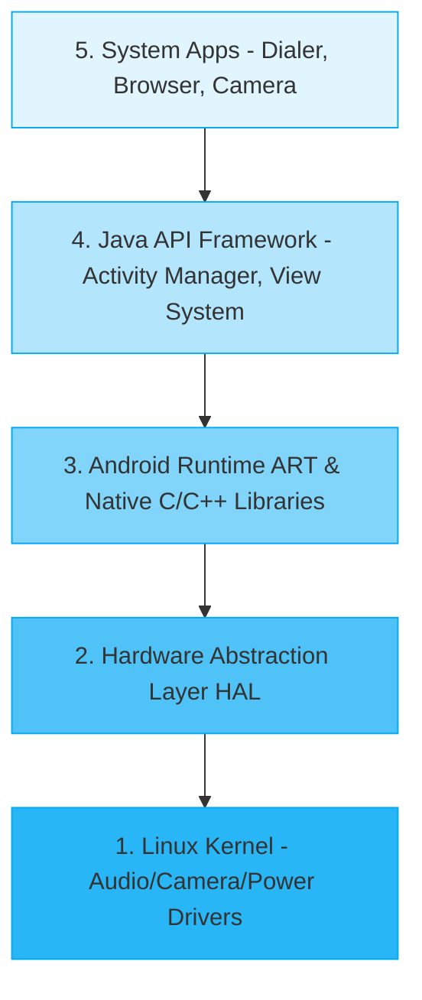

# Mobile Application Development (MAD) - Part 3
**Questions 36 to 50: Analytical & Comparative Questions**

এই শেষ পার্টে মূলত ব্যাখ্যামূলক এবং তুলনামূলক (পার্থক্য) প্রশ্নগুলো আছে। আপনার কথা মতো যেখানে যেখানে **উদাহরণ, ছক (Table) বা ডায়াগ্রাম** দিলে স্যারেরা খুশি হয়ে বেশি মার্কস দেবেন, আমি সেখানে সেগুলো অ্যাড করে দিয়েছি!

---

### 36. Analyze advantages of Android being open source.
**English:** 
1. **Free to use:** Manufacturers can use and customize it without paying licensing fees.
2. **Large Community:** Thousands of developers constantly improve the code and fix bugs.
3. **Customizability:** Companies like Samsung or Xiaomi can build their own custom UI (like OneUI or MIUI) on top of Android.
**বাংলা সামারি:** যেহেতু এটা ওপেন-সোর্স (ফ্রি), তাই যে কেউ এর কোড চেঞ্জ করে নিজের মতো ডিজাইন বানাতে পারে (যেমন- শাওমির আলাদা ডিজাইন)। আর ফ্রী হওয়ার কারণে ফোনের দামও কম হয়।

### 37. Compare Android architecture layers and their roles.
**English:** The architecture is built in a stack.

**বাংলা সামারি:** এই ডায়াগ্রামটা খাতায় এঁকে দিলে একদম ফুল মার্কস! সবচেয়ে নিচে হার্ডওয়্যার (লিনাক্স), তার উপরে ইঞ্জিন (ART), আর সবার উপরে আমাদের ব্যবহার করা অ্যাপ।

### 38. Analyze the importance of Activity lifecycle in memory management.
**English:** Proper lifecycle management prevents memory leaks and saves battery. For example, if a user switches to another app, the current activity goes to the `onStop()` state. If the phone runs out of memory, the Android system can safely destroy this stopped activity to free up RAM.
**বাংলা সামারি:** আমরা যখন গেম খেলতে খেলতে হঠাৎ মেসেঞ্জারে যাই, তখন গেমটা `onStop()` স্টেটে চলে যায়। এরপর যদি ফোনের র‍্যাম ফুল হয়ে যায়, তখন সিস্টেম ওই গেমটাকে নিজে থেকেই রিমুভ করে দিয়ে মেমরি বাঁচায়।

### 39. Compare Activity and Service.
**English:**
| Feature | Activity | Service |
| :--- | :--- | :--- |
| **UI (User Interface)** | Has a visible UI. | Has NO visible UI. |
| **Execution** | Runs in the foreground (user interacts with it). | Runs in the background (hidden). |
| **Example** | A login screen or a chat screen. | Playing music in the background or downloading a file. |

**বাংলা সামারি:** সোজা কথায়, চোখে যা দেখি সেটা Activity (যেমন চ্যাটবক্স), আর ব্যাকগ্রাউন্ডে যা চলে সেটা Service (যেমন গান বাজানো)।

### 40. Analyze how Intents enable communication between components.
**English:** Intents act as the "glue" between different parts of the OS. They carry a payload of data (using `putExtra`) from one component to another. 
*Example:* When you click a share button on an image, an Implicit Intent is fired to the OS, which then opens a list of apps (WhatsApp, Facebook) that can handle image sharing.
**বাংলা সামারি:** ইনটেন্ট হলো মেসেঞ্জারের মতো। এক স্ক্রিন থেকে অন্য স্ক্রিনে শুধু ইউজারকেই নেয় না, সাথে ডাটাও (ছবি বা টেক্সট) বহন করে নিয়ে যায়।

### 41. Evaluate the importance of permissions in Android apps.
**English:** Permissions protect user privacy and system security. Without the permission system, any app could secretly record audio, read personal SMS, or track the user's location. By enforcing permissions in the `AndroidManifest.xml`, users have control over their data.
**বাংলা সামারি:** পারমিশন না থাকলে যেকোনো অ্যাপ আপনার অজান্তেই আপনার ক্যামেরা বা গ্যালারি হ্যাক করতে পারতো। পারমিশন ইউজারদের ডাটা সিকিউর রাখে।

### 42. Compare LinearLayout and ConstraintLayout performance.
**English:** 
* **LinearLayout:** Can cause performance drops if nested too deeply (e.g., a LinearLayout inside another LinearLayout inside another). The system takes longer to measure and draw the UI.
* **ConstraintLayout:** Highly optimized for performance. It keeps the view hierarchy "flat" (no nesting), making it faster to render complex UIs.
**বাংলা সামারি:** লিনিয়ার লেআউটে বাক্সের ভেতর বাক্স রাখলে ফোন স্লো হয়ে যায় (Nesting)। কিন্তু কনস্ট্রেইন্ট লেআউটে কোনো বাক্স লাগে না, স্প্রিং দিয়ে কানেক্ট করা যায় বলে এটা অনেক ফাস্ট!

### 43. Analyze how poor UI design affects user experience.
**English:** A poor UI (cluttered buttons, unreadable text, unresponsive touches) leads to high user frustration and app uninstalls. If users cannot easily find what they are looking for, the app fails its primary purpose.
**বাংলা সামারি:** ডিজাইন খারাপ হলে বা বাটন ঠিকমতো কাজ না করলে মানুষ রেগে গিয়ে সাথে সাথেই অ্যাপ আনইনস্টল করে দেয়!

### 44. Compare class and object with real-life example.
**English:**
| Feature | Class | Object |
| :--- | :--- | :--- |
| **Definition** | A blueprint or template. | A real, physical instance of the class. |
| **Memory** | Does not consume memory. | Consumes memory when created. |
| **Example** | A building's architectural plan (Blueprint). | The actual physical building made of bricks. |

**বাংলা সামারি:** ক্লাস হলো বাড়ির কাগজের নকশা (যেটার কোনো ওজন বা জায়গা নেই), আর অবজেক্ট হলো সেই নকশা দেখে বানানো আসল বাড়িটা (যেটা জায়গা দখল করে)।

### 45. Analyze benefits of encapsulation in Android apps.
**English:** 
1. **Security:** Protects sensitive data (like user passwords) from being accidentally modified by other classes.
2. **Control:** Developers can make variables read-only or write-only using Getter and Setter methods.
**বাংলা সামারি:** অ্যাপের সেনসিটিভ ডাটা (যেমন পাসওয়ার্ড বা ব্যালেন্স) যেন অন্য কোনো কোড ভুলে চেঞ্জ করে না ফেলে, তাই সেগুলোকে Encapsulation এর মাধ্যমে লুকিয়ে রাখা হয়।

### 46. Compare inheritance and polymorphism.
**English:**
| Inheritance | Polymorphism |
| :--- | :--- |
| Acquiring properties from a parent class. | Performing a single action in different ways. |
| **Goal:** Code reusability. | **Goal:** Flexibility and method overriding. |
| *Example:* `Dog extends Animal` | *Example:* Both Dog and Cat have `sound()` method, but Dog barks and Cat meows. |

### 47. Analyze ListView limitations in modern apps.
**English:** 
1. **High Memory Usage:** It creates a new View for every single item in the list. If there are 1000 items, it creates 1000 views, which lags the phone.
2. **No built-in animations:** Adding animations for item insertion/deletion is very difficult.
**বাংলা সামারি:** লিস্টভিউতে ১০০০টা আইটেম থাকলে সে ১০০০টা বক্স বানায়, যার কারণে মেমরি ফুল হয়ে ফোন হ্যাং করে।

### 48. Evaluate why RecyclerView is preferred over ListView.
**English:** 
1. **View Recycling:** As a user scrolls down, the views that go off the top of the screen are cleared and *reused* at the bottom. For a list of 1000 items, it only creates 10-15 views in memory!
2. **Layout Managers:** Can easily switch between vertical list, horizontal list, or grid layouts.
**বাংলা সামারি:** রিসাইক্লার ভিউ ১০০০টা আইটেমের জন্য মাত্র ১০-১৫টা বক্স বানায়। স্ক্রল করার সময় ওপরের বক্সগুলোই নিচে এসে নতুন আইটেম দেখায় (রিসাইকেল হয়)। তাই এটা সুপার ফাস্ট!

### 49. Analyze Adapter pattern in Android UI.
**English:** The Adapter Pattern acts as a translator between raw data (like a database or JSON array) and a UI component (like RecyclerView). The UI component doesn't know how to read the database, so the Adapter reads the data and hands it over to the UI in a format it understands.
**বাংলা সামারি:** UI নিজে থেকে ডাটাবেস পড়তে পারে না। অ্যাডাপ্টার ডাটাবেস থেকে ডাটা নিয়ে এসে UI কে সুন্দর করে সাজিয়ে দেয়।

### 50. Evaluate mobile app development challenges (battery, memory, UI).
**English:**
1. **Battery:** Apps running heavy background services or GPS drain battery fast. Developers must optimize background tasks.
2. **Memory:** Mobile devices have limited RAM. Memory leaks (not destroying unused objects) crash the app.
3. **UI Fragmentation:** There are thousands of different screen sizes (phones, tablets, foldables). Developers must create responsive layouts (like ConstraintLayout) to fit all screens.
**বাংলা সামারি:** মোবাইল অ্যাপ বানানোর ৩টা বড় প্যারা হলো: এমনভাবে কোড করতে হবে যেন ব্যাটারি শেষ না হয়, র‍্যাম ফুল হয়ে অ্যাপ ক্র্যাশ না করে, আর ছোট-বড় সব সাইজের স্ক্রিনেই যেন ডিজাইন না ভাঙে।
