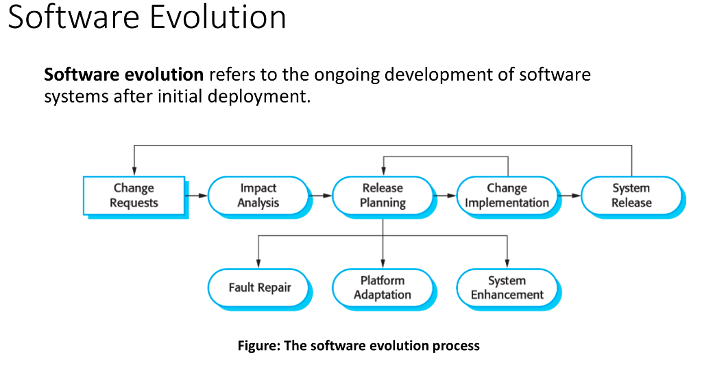

# SIM Lecture 2 & 3 - Exam Guide (Short & Easy)

## Lecture 2: Software Maintenance & Evolution

### 1. What is Software Evolution? (Slide 6) 🌟
**English:**
*   **Software Evolution:** It is the ongoing development of software after its initial release.

**💡 Diagram (Software Evolution Process):**

**🧠 Memory Trick (ডায়াগ্রাম মনে রাখার শর্টকাট):**
১. মেইন বক্সগুলো মনে রাখুন **C-I-R-C-S** দিয়ে:
*   **C**hange Requests ➡️ **I**mpact Analysis ➡️ **R**elease Planning ➡️ **C**hange Implementation ➡️ **S**ystem Release.
২. মাঝখানের *Release Planning* থেকে নিচের দিকে ৩টা বক্স নেমেছে, মনে রাখুন **FPS** গেম দিয়ে:
*   **F**ault Repair, **P**latform Adaptation, **S**ystem Enhancement.

**বাংলা সামারি:** সফটওয়্যার রিলিজ দেওয়ার পর সেটাকে রেগুলার আপডেট করাকে Evolution বলে। 

### 2. What is Software Maintenance and its Types? (Slide 10, 11) 🌟
**English:**
*   **Software Maintenance:** It is the process of modifying software after delivery to fix faults, improve performance, or adapt to a new environment.
*   **Types of Maintenance:**
    1.  **Corrective (Fault repairs):** Fixes errors and bugs discovered after deployment.
    2.  **Adaptive (Environmental adaptation):** Changes made to keep software usable in a changing environment (like a new OS).
    3.  **Perfective (Functionality addition):** Enhancements to improve performance or add new features.
    4.  **Preventive:** Changes made to prevent future problems.

**বাংলা সামারি:** রিলিজের পর বাগ ফিক্স করা বা নতুন ফিচারের জন্য মডিফাই করাকে Maintenance বলে। এটা ৪ প্রকার: Corrective (বাগ ফিক্স), Adaptive (নতুন পরিবেশে খাপ খাওয়ানো), Perfective (পারফরম্যান্স বা নতুন ফিচার অ্যাড), Preventive (ভবিষ্যতের সমস্যা আটকানো)।

### 3. Maintenance Cost and Increasing Factors (Slide 12, 13, 14)
**English:**
*   Maintenance takes up roughly **two-thirds (67%)** of the IT budget, while new development takes one-third.
*   **Factors Increasing Cost:**
    1.  **Team Stability:** Original developers leave, and new staff lack system knowledge.
    2.  **Poor Development Practice:** Developers may not focus on maintainability to save time.
    3.  **Staff Skills:** Maintenance is often assigned to junior or inexperienced staff.
    4.  **Program Age & Structure:** Older systems have poor structure, making them harder to modify.
    5.  **Documentation:** Documentation may be missing or outdated.
**বাংলা সামারি:** নতুন সফটওয়্যার বানানোর চেয়ে মেইনটেন্যান্সে খরচ অনেক বেশি হয় (প্রায় ৬৭%)। এর কারণ হলো— পুরোনো টিম মেম্বাররা চলে যায়, নতুনরা কোড বোঝে না, ডেভেলপাররা মেইনটেন্যান্সের কথা না ভেবেই কোড লেখে, আর পুরোনো সিস্টেমের স্ট্রাকচার ও ডকুমেন্টেশন অনেক খারাপ থাকে।

### 4. Software Reengineering (Slide 16, 17)
**English:**
*   **Definition:** It focuses on improving the internal structure of existing software without changing its external behavior.
*   **Goal:** To reduce future maintenance costs.
*   **Why it is needed:**
    1.  Legacy (old) systems are business-critical.
    2.  The current system is difficult to maintain.
    3.  Code structure has degraded over time.
    4.  Replacing the whole system is too risky and expensive.
**বাংলা সামারি:** সফটওয়্যারের বাইরের কাজ বা ফিচার ঠিক রেখে ভেতরের কোড স্ট্রাকচারকে ইম্প্রুভ করাকেই Reengineering বলে। এটা করা হয় যাতে ফিউচারে মেইনটেন্যান্স খরচ কমে যায়। পুরো সিস্টেম নতুন করে বানানো অনেক রিস্কি এবং এক্সপেনসিভ, তাই রি-ইঞ্জিনিয়ারিং করা হয়।

### 5. Legacy System Management (Slide 20, 21, 22, 23, 24, 25) 🌟
**English:**
*   **Legacy Systems:** Old systems that are still useful and critical to the business, but use outdated technology and are expensive to maintain.
*   **Management Options (Based on Quality and Value):**
    1.  **Low Quality, Low Business Value:** Scrap (discard) the system completely.
    2.  **Low Quality, High Business Value:** Reengineer the system to improve its maintainability.
    3.  **High Quality, Low Business Value:** Leave unchanged and continue normal maintenance.
    4.  **High Quality, High Business Value:** Keep in operation and continue normal maintenance (no replacement needed).
**বাংলা সামারি:** লিগ্যাসি সিস্টেম মানে হলো অনেক পুরোনো কিন্তু বিজনেসের জন্য খুব ইম্পর্টেন্ট সিস্টেম। যদি সিস্টেমের কোয়ালিটি এবং বিজনেসের ভ্যালু দুইটাই খারাপ হয়, তবে ওটা ফেলে দিতে হয় (Scrap)। আর যদি কোয়ালিটি খারাপ কিন্তু বিজনেসের জন্য খুব ইম্পর্টেন্ট হয়, তখন সেটাকে Reengineer করতে হয়।

---

## Lecture 3: Software Configuration Management (SCM)

### 6. What is SCM and Why is it Important? (Slide 2, 3, 4)
**English:**
*   **Definition:** SCM is an umbrella activity that manages and controls changes in software projects from beginning to end.
*   **Example:** Like Google Drive version history, it tracks who changed what and when.
*   **Why it is important:**
    1.  Software constantly changes due to new requirements.
    2.  It prevents confusion and mistakes among developers.
    3.  It ensures the correct version of the software is always used.
    4.  It helps teams work together smoothly.
**বাংলা সামারি:** প্রোজেক্ট শুরু থেকে শেষ পর্যন্ত সফটওয়্যারে যত চেঞ্জ হয়, সেগুলো ম্যানেজ এবং কন্ট্রোল করাকেই SCM বলে (যেমন গিটহাব বা গুগল ড্রাইভের ভার্সন হিস্টোরি)। এটা না থাকলে ডেভেলপারদের মধ্যে কনফিউশন তৈরি হয় এবং ভুল ভার্সন রিলিজ হয়ে যেতে পারে।

### 7. Main Tasks of SCM (Slide 8, 9, 13, 14) 🌟
**English:**
1.  **Configuration Identification:** Identifies all items that need to be controlled (called Configuration Items or CIs). *Example: Source code, test plans, index.html.*
2.  **Version Control:** Keeps track of different versions of software. It allows developers to go back to older versions (e.g., using Git).
3.  **Change Control:** A systematic process to manage changes. It ensures only necessary and approved changes are made.
    *   **Engineering Change Order (ECO):** A formal document that requests a change (includes reason, impact, and approval status).
**বাংলা সামারি:** SCM এর মেইন কাজ হলো ৩টা: ১. কোন কোন ফাইলে চেঞ্জ ট্র‍্যাক করতে হবে সেটা সিলেক্ট করা (Identification), ২. আগের ভার্সনগুলো সেভ রাখা যাতে যেকোনো সময় ব্যাক করা যায় (Version Control), ৩. কেউ হুট করে কোড চেঞ্জ করতে চাইলে সেটা রিভিউ করে অ্যাপ্রুভ করা (Change Control)।

### 8. Semantic Versioning (SemVer) (Slide 10, 11, 12) 🌟
**English:**
*   **Format:** `MAJOR.MINOR.PATCH` (Example: 1.8.5)
*   **Rules:**
    1.  **MAJOR:** Increases for big, breaking changes (e.g., 1.0.0 → 2.0.0).
    2.  **MINOR:** Increases for new features (e.g., 1.2.0 → 1.3.0).
    3.  **PATCH:** Increases for bug fixes (e.g., 1.2.1 → 1.2.2).
    *   *Note:* Patch resets to 0 when Minor increases. Both Patch and Minor reset to 0 when Major increases.
*   **Pre-release:** Used to test software before final release (e.g., 1.0.0-alpha, 1.0.0-beta).
**বাংলা সামারি:** সফটওয়্যারের ভার্সন নাম্বার দেওয়ার নিয়ম হলো SemVer (যেমন: ১.৮.৫)। বড় কোনো চেঞ্জ আসলে Major (১) বাড়ে। নতুন ফিচার আসলে Minor (৮) বাড়ে। আর ছোটখাটো বাগ ফিক্স করলে Patch (৫) বাড়ে।
