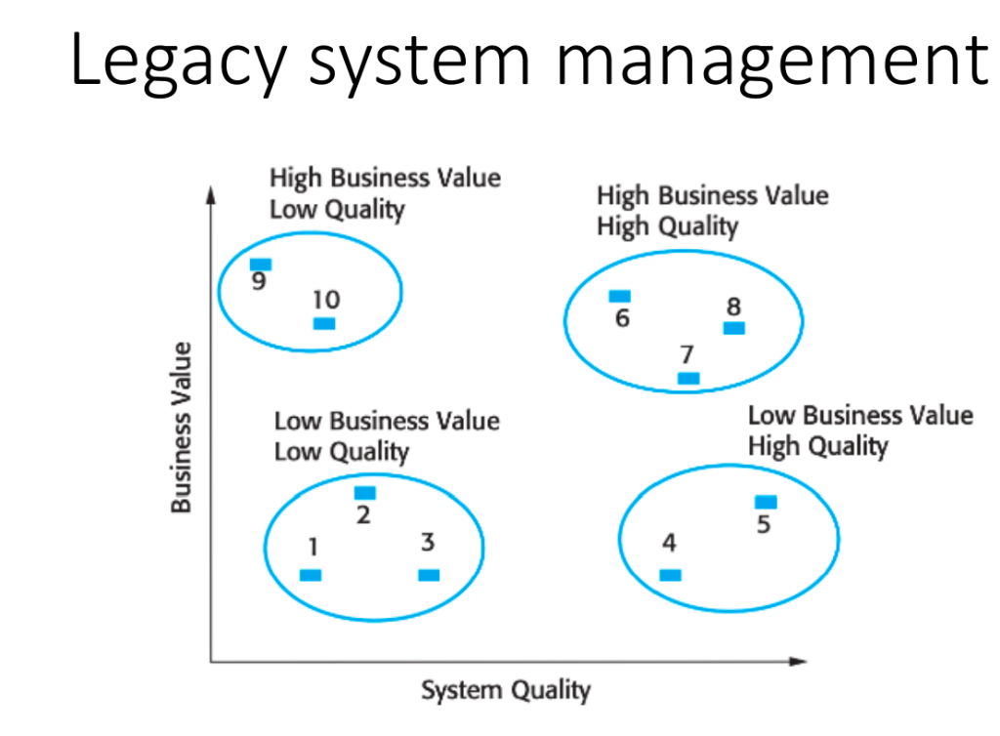

# SIM Lecture 2 & 3 - Exam Guide (Short & Easy)

## Lecture 2: Software Maintenance & Evolution

### 1. What is Software Evolution? (Slide 6) 🌟
**English:**
*   **Software Evolution:** It means updating and developing software continuously after the first release.

**💡 Diagram (Software Evolution Process):**

**🧠 Memory Trick (ডায়াগ্রাম মনে রাখার শর্টকাট):**
১. মেইন বক্সগুলো মনে রাখুন **C-I-R-C-S** দিয়ে:
*   **C**hange Requests ➡️ **I**mpact Analysis ➡️ **R**elease Planning ➡️ **C**hange Implementation ➡️ **S**ystem Release.
২. মাঝখানের *Release Planning* থেকে নিচের দিকে ৩টা বক্স নেমেছে, মনে রাখুন **FPS** গেম দিয়ে:
*   **F**ault Repair, **P**latform Adaptation, **S**ystem Enhancement.

**বাংলা সামারি:** সফটওয়্যার রিলিজ দেওয়ার পর সেটাকে রেগুলার আপডেট করাকে Evolution বলে। 

### 2. What is Software Maintenance and its Types? (Slide 10, 11) 🌟
**English:**
*   **Software Maintenance:** It means changing the software to fix bugs or add new features.
*   **Types of Maintenance:**
    1.  **Corrective:** Fixes bugs after release.
    2.  **Adaptive:** Updates software for a new environment (like a new OS).
    3.  **Perfective:** Adds new features or improves performance.
    4.  **Preventive:** Stops future problems before they happen.

**বাংলা সামারি:** রিলিজের পর বাগ ফিক্স করা বা নতুন ফিচারের জন্য মডিফাই করাকে Maintenance বলে। এটা ৪ প্রকার: Corrective (বাগ ফিক্স), Adaptive (নতুন পরিবেশে খাপ খাওয়ানো), Perfective (পারফরম্যান্স বা নতুন ফিচার অ্যাড), Preventive (ভবিষ্যতের সমস্যা আটকানো)।

### 3. Maintenance Cost and Increasing Factors (Slide 12, 13, 14)
**English:**
*   Maintenance costs more than new development (67% of the budget).
*   **Factors Increasing Cost:**
    1.  **Team Stability:** Old developers leave. New developers do not understand the system.
    2.  **Poor Practice:** Developers write bad code to save time.
    3.  **Staff Skills:** Junior staff do the maintenance work.
    4.  **Program Age:** Old software has a bad code structure.
    5.  **Documentation:** Documentation is missing or outdated.
**বাংলা সামারি:** নতুন সফটওয়্যার বানানোর চেয়ে মেইনটেন্যান্সে খরচ অনেক বেশি হয় (প্রায় ৬৭%)। এর কারণ হলো— পুরোনো টিম মেম্বাররা চলে যায়, নতুনরা কোড বোঝে না, ডেভেলপাররা মেইনটেন্যান্সের কথা না ভেবেই কোড লেখে, আর পুরোনো সিস্টেমের স্ট্রাকচার ও ডকুমেন্টেশন অনেক খারাপ থাকে।

### 4. Software Reengineering (Slide 16, 17)
**English:**
*   **Definition:** It means improving the internal code without changing external features.
*   **Goal:** To reduce future maintenance cost.
*   **Why it is needed:**
    1.  Old systems are important for business.
    2.  The system is hard to maintain.
    3.  Code structure is very bad.
    4.  Replacing the whole system is risky and costly.
**বাংলা সামারি:** সফটওয়্যারের বাইরের কাজ বা ফিচার ঠিক রেখে ভেতরের কোড স্ট্রাকচারকে ইম্প্রুভ করাকেই Reengineering বলে। এটা করা হয় যাতে ফিউচারে মেইনটেন্যান্স খরচ কমে যায়। পুরো সিস্টেম নতুন করে বানানো অনেক রিস্কি এবং এক্সপেনসিভ, তাই রি-ইঞ্জিনিয়ারিং করা হয়।

### 5. Legacy System Management (Slide 20-25) 🌟
**English:**
*   **Legacy Systems:** Old systems that are very important for business, but use old technology and cost too much to maintain.
*   **Management Options:**
    1.  **Low Quality, Low Value:** Throw away the system.
    2.  **Low Quality, High Value:** Reengineer the system.
    3.  **High Quality, Low Value:** Do normal maintenance.
    4.  **High Quality, High Value:** Keep it and do normal maintenance.

**💡 Diagram (Legacy System Assessment):**

**বাংলা সামারি:** লিগ্যাসি সিস্টেম মানে হলো অনেক পুরোনো কিন্তু বিজনেসের জন্য খুব ইম্পর্টেন্ট সিস্টেম। যদি সিস্টেমের কোয়ালিটি এবং বিজনেসের ভ্যালু দুইটাই খারাপ হয়, তবে ওটা ফেলে দিতে হয় (Scrap)। আর যদি কোয়ালিটি খারাপ কিন্তু বিজনেসের জন্য খুব ইম্পর্টেন্ট হয়, তখন সেটাকে Reengineer করতে হয়।

---

## Lecture 3: Software Configuration Management (SCM)

### 6. What is SCM and Why is it Important? (Slide 2, 3, 4)
**English:**
*   **Definition:** SCM manages and controls all changes in a software project.
*   **Example:** Like Google Drive history, it tracks who changed what and when.
*   **Why it is needed:**
    1.  Software changes all the time.
    2.  It stops confusion among developers.
    3.  It keeps the correct version of the software.
    4.  It helps teams work together.
**বাংলা সামারি:** প্রোজেক্ট শুরু থেকে শেষ পর্যন্ত সফটওয়্যারে যত চেঞ্জ হয়, সেগুলো ম্যানেজ এবং কন্ট্রোল করাকেই SCM বলে (যেমন গিটহাব বা গুগল ড্রাইভের ভার্সন হিস্টোরি)। এটা না থাকলে ডেভেলপারদের মধ্যে কনফিউশন তৈরি হয় এবং ভুল ভার্সন রিলিজ হয়ে যেতে পারে।

### 7. Main Tasks of SCM (Slide 8, 9, 13, 14) 🌟
**English:**
1.  **Identification:** Selects all files that need tracking (Source code, test plans).
2.  **Version Control:** Saves older versions so you can go back (like Git).
3.  **Change Control:** Checks and approves all changes before saving.
    *   **ECO (Engineering Change Order):** A document to request a change.
**বাংলা সামারি:** SCM এর মেইন কাজ হলো ৩টা: ১. কোন কোন ফাইলে চেঞ্জ ট্র‍্যাক করতে হবে সেটা সিলেক্ট করা (Identification), ২. আগের ভার্সনগুলো সেভ রাখা যাতে যেকোনো সময় ব্যাক করা যায় (Version Control), ৩. কেউ হুট করে কোড চেঞ্জ করতে চাইলে সেটা রিভিউ করে অ্যাপ্রুভ করা (Change Control)।

### 8. Semantic Versioning (SemVer) (Slide 10, 11, 12) 🌟
**English:**
*   **Format:** `MAJOR.MINOR.PATCH` (Example: 1.8.5)
*   **Rules:**
    1.  **MAJOR:** For big changes (e.g., 1.0.0 → 2.0.0).
    2.  **MINOR:** For new features (e.g., 1.2.0 → 1.3.0).
    3.  **PATCH:** For bug fixes (e.g., 1.2.1 → 1.2.2).
    *   *Note:* Patch becomes 0 when Minor increases. Both Patch and Minor become 0 when Major increases.
*   **Pre-release:** Used to test software before final release (e.g., 1.0.0-beta).
**বাংলা সামারি:** সফটওয়্যারের ভার্সন নাম্বার দেওয়ার নিয়ম হলো SemVer (যেমন: ১.৮.৫)। বড় কোনো চেঞ্জ আসলে Major (১) বাড়ে। নতুন ফিচার আসলে Minor (৮) বাড়ে। আর ছোটখাটো বাগ ফিক্স করলে Patch (৫) বাড়ে।
