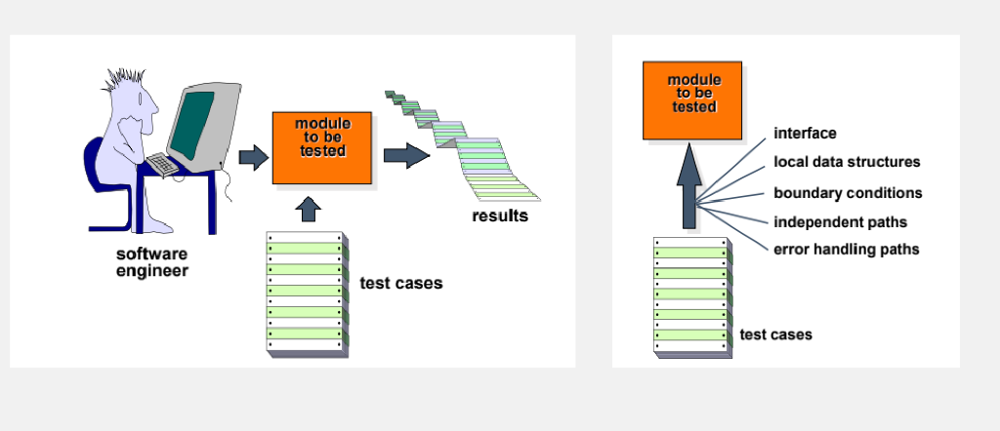
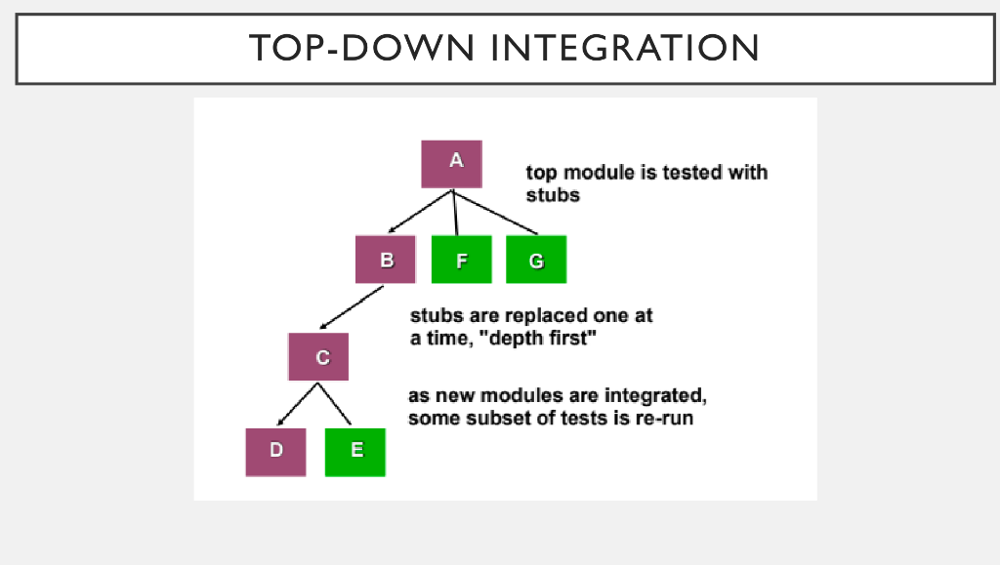
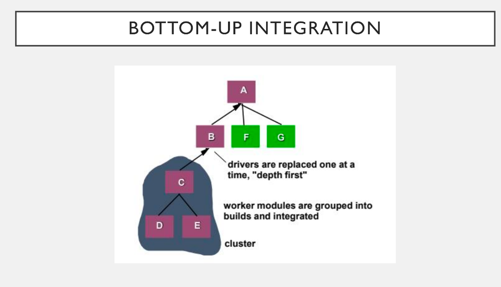
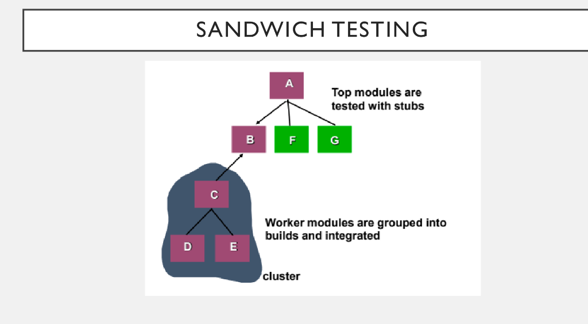
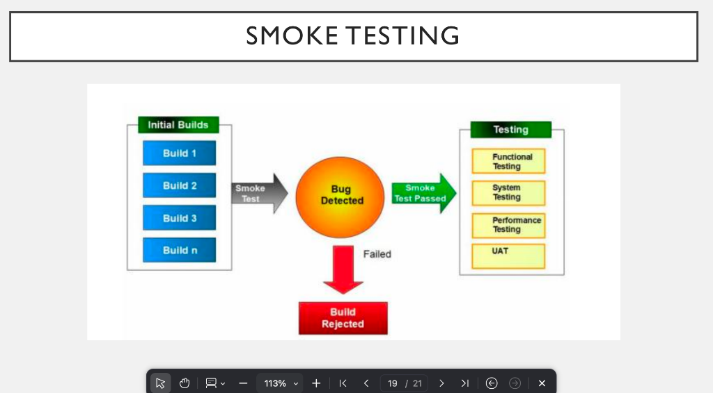

# SIM Compulsory Part: Lecture 5 & 6 (Short Suggestion)

---

## 📌 Lecture 5: Software Testing Strategies & Debugging
*(Suggested Slides: 2, 5-8, 14-21)*

### 1. What is Testing Strategy? (Slide 2)
**English:** A well-planned approach that provides a roadmap for testing. It defines:
*   What to test and when to test.
*   Required time, effort, and resources.
*   **Key activities:** Test planning $\rightarrow$ Test case design $\rightarrow$ Test execution $\rightarrow$ Result evaluation.
**বাংলা সামারি:** সফটওয়্যার টেস্টিংয়ের পুরো প্ল্যানিং বা রোডম্যাপ। কী টেস্ট করব, কখন করব এবং কত সময় লাগবে, সেটাই টেস্টিং স্ট্র্যাটেজি।

### 2. Difference between Verification and Validation (V&V). (Slide 5) 🌟
**English:**
| Verification (Building the product right) | Validation (Building the right product) |
| :--- | :--- |
| Ensures the software correctly implements required functions. | Ensures the software meets customer requirements. |
| Focuses on **design and specifications**. | Focuses on **user needs and expectations**. |
| **Question:** "Are we building the product right?" | **Question:** "Are we building the right product?" |

**বাংলা সামারি:** **Verification** হলো আমি ডিজাইনের নিয়ম মেনে কোড লিখছি কি না। আর **Validation** হলো কাস্টমার আসলে যেটা চেয়েছিল, আমি সেটা বানাচ্ছি কি না।

### 3. Key SQA Activities in V&V. (Slide 6)
**English:**
1. Formal technical reviews (early error detection)
2. Quality & configuration audits
3. Performance monitoring (speed and efficiency)
4. Simulation (testing in virtual environments)
5. Feasibility study
6. Documentation review
7. Algorithm analysis

### 4. Organizing for Testing (Psychological Perspective & Misconceptions). (Slide 7)
**English:**
*   **Psychological Perspective:** For a developer, building a software is a creative process. So, testing often feels "destructive" to them because its main goal is to find flaws in their hard work.
*   **Common Misconceptions (ভুল ধারণা):**
    1. "Developers should not test." $\rightarrow$ Incorrect.
    2. "Software should be thrown over the wall to outsiders." $\rightarrow$ Incorrect.
    3. "Testers join only at the end." $\rightarrow$ Incorrect.
*   **Reality (সত্যিটা কী):**
    1. Testing should be a collaborative effort.
    2. Developers and testers must work together.
    3. Testing should start early and continue throughout the development process.

### 5. Testing Strategy for Conventional Software. (Slide 8)
**English:**
1.  **Unit Testing:** Focuses on individual components/modules.
2.  **Integration Testing:** Ensures that units work together correctly.
3.  **Validation Testing:** Checks if the system meets user expectations.
4.  **System Testing:** Tests the software as a whole (full system).
**💡 Mnemonic:** **UIVS** (ইউ আই ভি এস) $\rightarrow$ Unit, Integration, Validation, System.

### 6. What is Debugging and its Process? (Slide 14, 15)
**English:** 
*   **Definition:** Debugging is the process of identifying, analyzing, and removing errors (bugs) from a software system after testing. It is often considered an **art** because it requires logical thinking, experience, and intuition rather than a fixed method.
*   **Debugging Process (Step-by-step):**
    1. It starts when a test case is executed.
    2. The actual output is compared with the expected result.
    3. Any mismatch between them is called a **symptom** of an error.
    4. The actual hidden root cause of the problem is investigated.
    5. Finally, the symptom is connected with the root cause, and the bug is fixed.
**বাংলা সামারি:** টেস্টিং শুধু ভুল (bug) খুঁজে বের করে, আর ডিবাগিং সেই ভুলটার আসল কারণ (root cause) খুঁজে বের করে সেটা সলভ করে।

### 7. Why is Debugging Difficult? (Slide 17, 18) 🌟
**English:** 
1. The symptom (where the error shows) and the root cause may be far apart in the code.
2. Fixing one bug may temporarily hide another bug.
3. Errors can be caused by **timing issues** instead of logic errors.
4. Difficulty in reproducing the exact error conditions.
5. Bugs that occur only occasionally (intermittent errors).

### 8. Debugging Strategies. (Slide 19-21)
**English:** Debugging is not random; it uses logic, experience, and tools. There are three main strategies:
1.  **Brute Force:** A simple debugging method that uses direct observation (like print statements, memory dumps, or logs). It is commonly used when no other method works, but it is often inefficient and time-consuming.
2.  **Backtracking:** A method that traces the program execution backward from the point where the error appeared. It is effective for small programs but difficult for large systems due to many possible paths.
3.  **Cause Elimination:** A systematic method that uses logical reasoning (induction and deduction) to eliminate possible causes step by step until the real cause is found. It is the most efficient and structured approach.
**বাংলা সামারি:** Brute Force হলো চোখ বন্ধ করে প্রিন্ট স্টেটমেন্ট দিয়ে ভুল খোঁজা। Backtracking হলো যেখান থেকে এরর এসেছে, সেখান থেকে উল্টো দিকে লাইন-বাই-লাইন চেক করা। আর Cause elimination হলো লজিক খাটিয়ে ভুল অপশনগুলো বাদ দিয়ে আসল ভুলের কাছে পৌঁছানো।

---

## 📌 Lecture 6: Test Strategies for Conventional Software
*(Suggested Slides: 3, 5, 7-18)*

### 1. What is Unit Testing and its Targets? (Slide 3, 5)
**English:** Unit testing focuses testing on a single function or software module's internal logic and data structures. 

**💡 Diagram (খাতায় আঁকার জন্য):**

*   **Targets for Unit Test Cases (কী কী চেক করা হয়):**
    1. **Module interface:** Ensures that information flows properly into and out of the module.
    2. **Local data structures:** Ensures that data stored temporarily maintains its integrity during execution.
    3. **Boundary conditions:** Ensures that the module operates properly at boundary values (limits).
    4. **Independent paths:** Ensures that all statements in a module have been executed at least once.
    5. **Error handling paths:** Ensures that the algorithms respond correctly to specific error conditions.

### 2. Drivers and Stubs in Unit Testing. (Slide 7) 🌟
**English:** 
*   **Driver:** A simple main program that accepts test case data, passes such data to the component being tested, and prints the returned results. (Acts like a temporary boss calling the module).
*   **Stub:** A dummy module that serves to replace subordinate modules called by the component to be tested. It uses the module’s exact interface, may do minimal data manipulation, and returns control to the testing module. (Acts like a temporary worker).
*   **Overhead:** Drivers and stubs both represent overhead. Both must be written but **don’t constitute part of the installed software product** (they are deleted/ignored in the final app).
**বাংলা সামারি:** একটা মডিউল টেস্ট করার সময় তার ওপরের লেভেলকে ডাকার জন্য লাগে **Driver**, আর তার নিচের লেভেলের মডিউল রেডি না থাকলে ডামি হিসেবে লাগে **Stub**। এগুলো শুধু টেস্ট করার জন্যই লেখা হয়, মেইন সফটওয়্যারে এগুলো থাকে না। 

### 3. Integration Testing and its Strategies. (Slide 8, 9)
**English:** 
*   **Definition:** It is a technique to build the software architecture. It tests the software to find errors in the interfaces.
*   **Objective:** To combine unit-tested modules and build the final program structure.
*   **Two Strategies:** 
    1. **Non-incremental (Big Bang):** Combining all modules at once. (Not recommended).
    2. **Incremental:** Combining and testing modules step-by-step.

### 4. Incremental Integration Testing (Top-Down vs Bottom-Up). (Slide 11-14) 🌟
**English:**
*(ছকটা শুধু পার্থক্য বা শর্ট প্রশ্নের জন্য মনে রাখবেন)*
| Feature | Top-Down Integration | Bottom-Up Integration |
| :--- | :--- | :--- |
| **Direction** | Moves downward through the hierarchy. | Starts from the lowest-level atomic modules. |
| **Needs** | Requires **Stubs**. | Requires **Drivers**. |
| **Advantage** | Verifies major control points early. | Verifies low-level data processing early. |
| **Disadvantage** | Stubs are needed; delayed data flow. | Drivers are needed; testing is incomplete until top modules are added. |

**📝 Detailed Explanation (For 6-7 Marks Broad Question):**

#### A. Top-Down Integration
*   **Process:** Modules are integrated by moving downward through the hierarchy, starting with the main module.
*   **Replacement:** Lower-level modules are temporarily replaced with **Stubs** (dummy modules).
*   **Strategy:** Stubs are replaced one at a time (either Depth-First or Breadth-First). As new modules are integrated, tests are re-run.

**💡 Diagram (খাতায় আঁকার জন্য):**

#### B. Bottom-Up Integration
*   **Process:** Integration and testing start with the lowest-level (atomic) modules.
*   **Replacement:** Since top-level modules are not ready, **Drivers** (temporary main programs) are used to test the lower-level modules.
*   **Strategy:** Worker modules are grouped into clusters/builds. Drivers are replaced one at a time as we move upward.

**💡 Diagram (খাতায় আঁকার জন্য):**

### 5. Sandwich Integration. (Slide 15, 16)
**English:** 
*   Combines both **top-down** and **bottom-up** integration approaches.
*   Applied to both high-level and low-level modules.
*   Uses **functional groups** of modules, completing one group before moving to the next.
*   Groups are based on control and data processing for specific program features.
*   Integration within a group alternates between high-level and low-level modules.
*   Once a functional group is complete, testing moves to the next group.
*   Gains advantages of both top-down and bottom-up while minimizing the heavy need for drivers and stubs.
*   Requires a disciplined approach to avoid a chaotic "big bang" scenario.

**💡 Diagram (খাতায় আঁকার জন্য):**

### 6. Regression Testing and Smoke Testing. (Slide 17-20) 🌟

#### A. Regression Testing
**English:**
*   **Definition:** It is the re-execution of selected tests. It ensures that recent code changes do not create new side effects.
*   **Purpose:** It ensures that bug fixes or updates do not create new errors in the software.
*   **Execution:** 
    *   It can be done **manually** by re-running old test cases.
    *   It can use **automated tools** for efficiency.

#### B. Smoke Testing
**English:**
*   **Definition:** It is a daily build test. It is used to expose "show-stopper" errors (major errors that stop the software from running).
*   **Steps:** 
    1. Integrate software components into a build.
    2. Include all necessary data files, libraries, and modules in the build.
    3. Run tests to find errors that prevent the build from working.
    4. Focus on uncovering major "show-stopper" errors.
    5. Test the integrated builds daily.
*   **Benefits (সুবিধা):**
    1. Minimizes integration risks early.
    2. Improves overall product quality.
    3. Simplifies error diagnosis and correction.
    4. Managers can easily track project progress.

**💡 Diagram (খাতায় আঁকার জন্য):**

**বাংলা সামারি:** নতুন কোনো কোড অ্যাড করার পর আগের পুরোনো কোড নষ্ট হলো কি না, সেটা চেক করাই হলো **Regression Testing**। আর প্রতিদিন পুরো সিস্টেমকে জোড়া লাগানোর পর অ্যাপটা অন্তত অন হচ্ছে কি না (ক্র্যাশ করছে কি না), সেটা চেক করাই হলো **Smoke Testing**।
